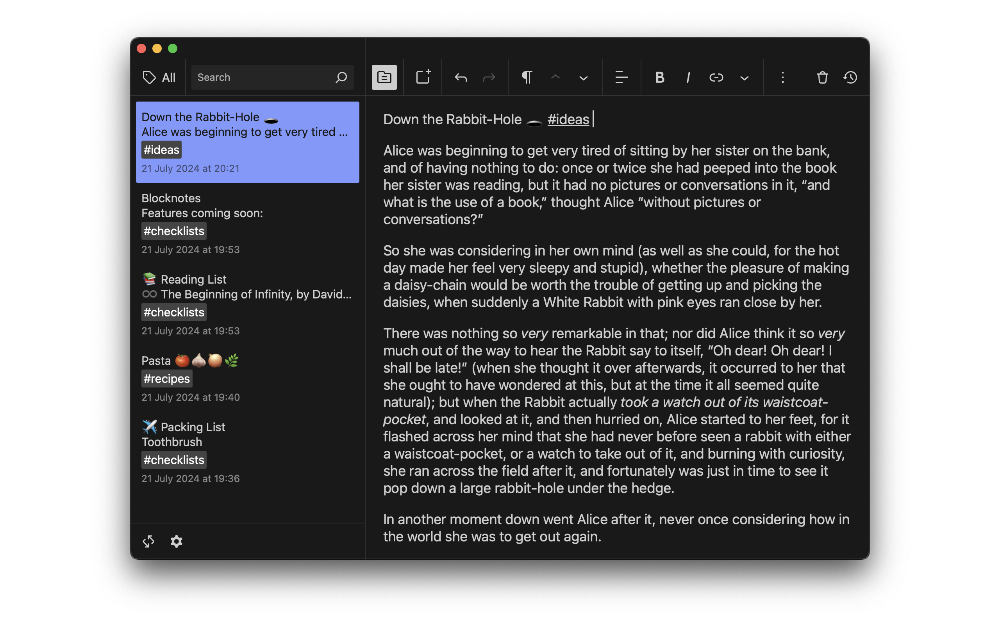
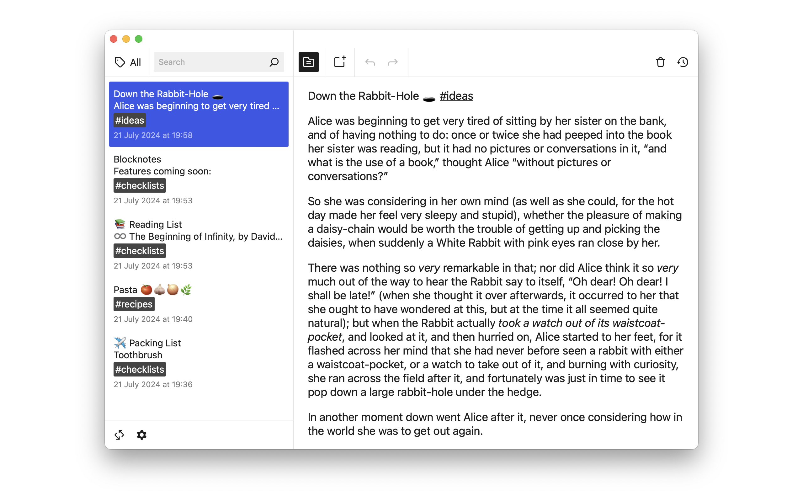

# Blocknotes

|Dark Note|Dark List|Light Note|Light List|
|-|-|-|-|
|||||

After cloning the repository and `npm install`, you can run `npm start` to run a
local server with the dev files.

Running the iOS and macOS apps is a bit slower, since it needs the `dist` files.
You can build the `dist` directory with `npm run build`, then `npx cap sync` to
sync the files to the `ios` directory. Open Xcode with `npx cap open ios`.

It uses [Capacitor](https://capacitorjs.com) to create the native apps from the
PWA. A modified version of `@capacitor/filesystem` is used to allow picking any
directory in the local filesystem. By default `@capacitor/filesystem` saves to
indexDB on the web, and a hidden app folder on iOS/macOS.
